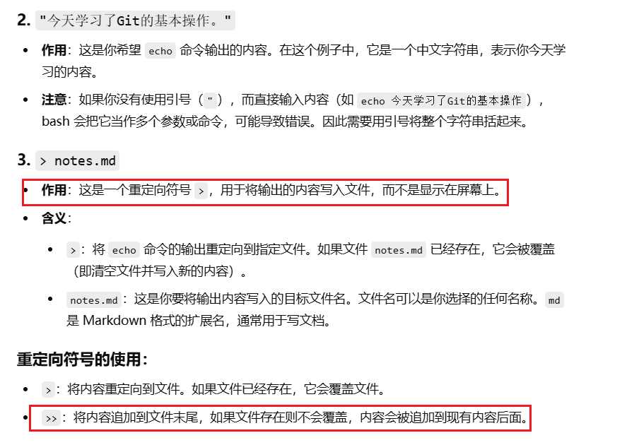
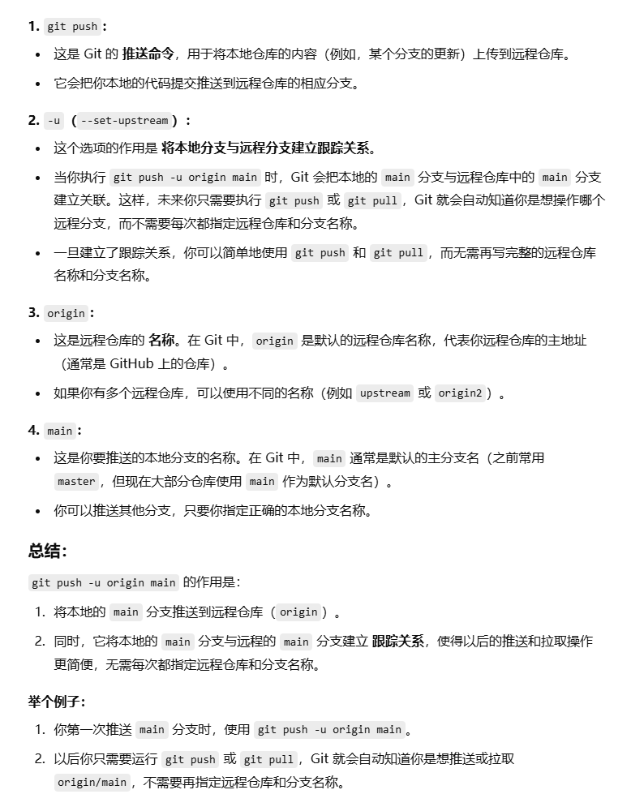
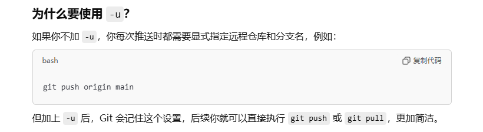
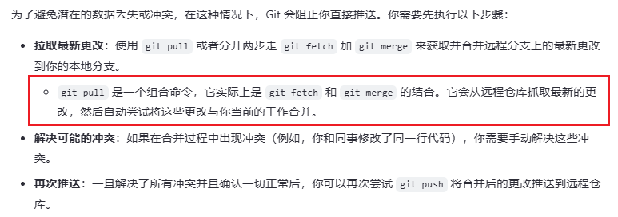

今天学习了Git的基本操作
主要是用于GitHub的一些简介什么的
创建repository后一般会教你

```bash
echo “bulabula”  >>  readme.md #其实这个就是说你要将什么写到readme里面
git init
git add *
git commit -m "my first commit"
git branch -M main
git remote add origin git@github.com:outside-ynn...
git push -u origin main
```

当然了其中你会出现很多问题，下面一点点来说：

##### 1.echo

- **作用**：`echo` 是一个命令行工具，用于打印输出字符串或变量的内容到标准输出（屏幕）。

- 示例

	```
	echo "Hello, world!"
	```

	上面的命令会在终端中显示 Hello, world!




##### 2.git init

初始化 Git 仓库


##### 3.git add .

**`git add`** 用于将文件添加到 Git 的 **暂存区**。暂存区是 Git 用来存储将要提交的更改的地方，文件在暂存区中只是暂时准备好，尚未被永久记录。


##### 4.git commit -m “my first commit”

 **`git commit`** 的作用：

**`git commit`** 用于将 **暂存区** 中的更改记录（即提交）到 Git 仓库中，成为 Git 版本历史的一部分。每次执行 `git commit`，都会创建一个新的“快照”或版本。

 **为什么 `git add` 后还需要执行 `git commit`？**

**`git add`** 只是准备工作，把改动从工作区移动到暂存区。它并没有把改动记录到 Git 的版本历史中。只有执行 **`git commit`**，这些改动才会被正式提交，形成一个版本快照。

**举个例子**： 想象你在写一篇文章，文章内容是通过不断修改的。

- **`git add`** 就像是把你修改好的段落保存到一个临时草稿本上，表示你准备好让别人看到这些修改。
- **`git commit`** 就像是你把草稿提交给编辑，成为正式的版本记录。这时，你就有了一个可以回溯的版本历史，每次提交都可以查看之前的修改。


##### 5.git branch -M main

**`git branch -M main`** 的作用是将你当前的本地分支从 **`master`**（或其他名字）重命名为 **`main`**。这个步骤的主要目的是为了 **与 GitHub 默认分支名一致**，并避免在推送时出现分支不一致的问题。


##### 6.`git remote add origin git@github.com:outside-ynn….`

将你的 **本地 Git 仓库** 与 **远程 Git 仓库** 关联起来，并指定远程仓库的 **URL**。


##### 7.git push -u origin main






